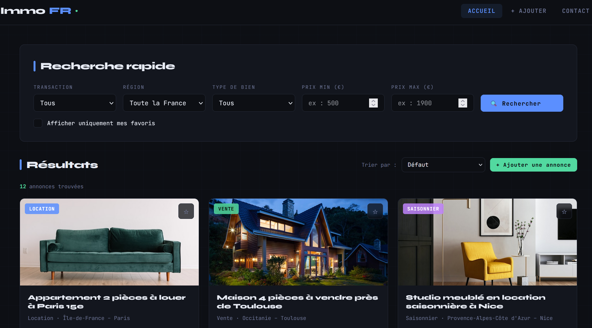
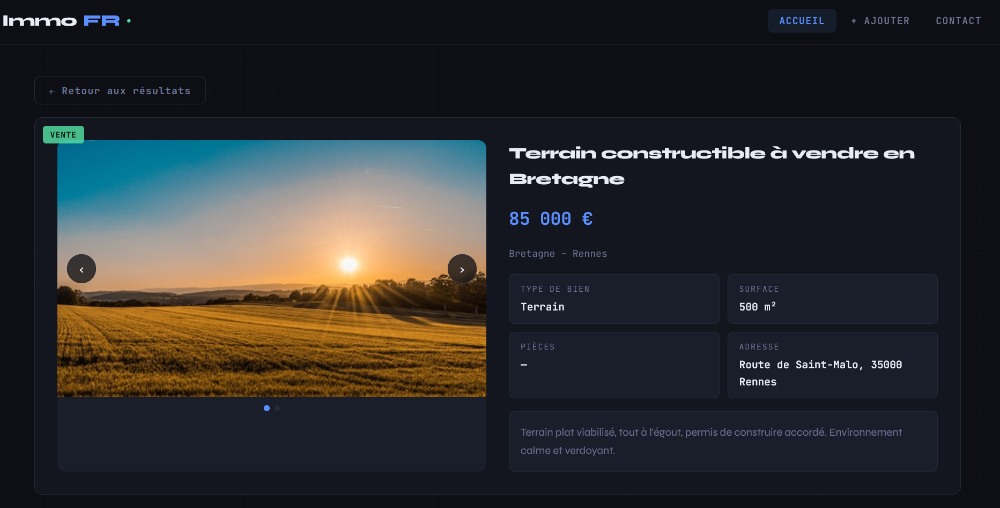
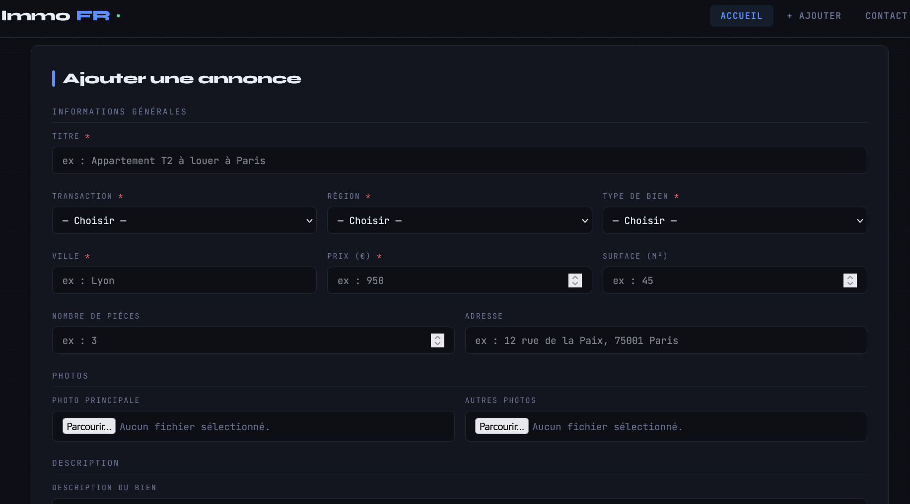

# 🏠 ImmoFR - Immobilier en France

> Plateforme web SPA de petites annonces immobilières - Projet académique L2 Informatique


---

## 📖 Contexte

Projet réalisé en binôme dans le cadre du cours de **Développement d'Applications Internet** (L2 STEE - UPPA, 2025-2026). L'objectif était de concevoir une application web **single-page** (SPA) de gestion d'annonces immobilières en HTML5, CSS3 et JavaScript vanilla, sans framework.

---

## ✨ Fonctionnalités

### Recherche & Filtres
- Filtre par type de transaction - Vente · Location · Saisonnier
- Filtre par région (8 régions françaises)
- Filtre par type de bien (Appartement, Studio, Maison, Local commercial, Terrain)
- Filtre par prix min / prix max
- Filtre "Afficher uniquement mes favoris"

### Résultats & Tri
- Affichage en grille responsive avec photo, type, localisation et prix
- Badges de transaction (Vente · Location · Saisonnier)
- Compteur "X annonces trouvées"
- Tri : Défaut, Prix croissant/décroissant, Plus récent/ancien, Surface croissante
- Pagination : 6 annonces par page avec navigation ‹ / numéros / ›
- Message "Aucun bien ne correspond" si liste vide

### Favoris
- Bouton ★ sur chaque carte pour ajouter/retirer
- Cohérent avec la pagination et le tri

### Fiche détaillée
- Carrousel de photos avec navigation ‹ / › et dots cliquables (boucle)
- Toutes les infos du bien (type, surface, pièces, adresse, description)
- Bouton "← Retour aux résultats" (conserve la page courante)

### CRUD - Ajout / Modification / Suppression
- Formulaire complet avec validation côté client (champs obligatoires en rouge)
- Pré-remplissage en mode modification
- Confirmation avant suppression
- Toast de confirmation pendant 3 secondes
- Gestion d'images via `URL.createObjectURL`

### Formulaire de contact
- Validation : nom, email, type de demande, message
- Messages d'erreur sous chaque champ invalide
- Toast de confirmation en vert, soumission sans rechargement

### UI
- Dark mode
- Responsive (breakpoints à 768px et 480px)

---

## 🛠️ Stack technique

HTML5 · CSS3 · JavaScript vanilla

> Aucune dépendance externe - projet 100% natif.

---

## 🏗️ Architecture

Le projet suit une architecture **SAM** (State – Action – Model – View) :

| Couche | Rôle |
|--------|------|
| `state` | Objet central : annonces, filtres, tri, page, favoris, vue active, carrousel |
| `actions` | Intentions utilisateur (`search`, `sort`, `goPage`, `openDetail`, `toggleFavori`, `submitAnnonce`, `deleteAnnonce`, `submitContact`…) |
| `model` | Logique métier (`applyFiltersAndSort`, `validateContactForm`, `validateAnnonceForm`) |
| `view` | Rendu DOM (`renderResults`, `buildCard`, `renderPagination`, `renderDetail`, `renderForm`, `showToast`) |

---

## 📂 Structure des fichiers

```
immofr/
├── index.html      ← structure SPA unique
├── styles.css      ← charte graphique
├── data.js         ← 12 annonces d'exemple
├── app.js          ← logique SAM complète
└── README.md
```

---

## 📸 Captures d'écran

| Accueil & Filtres | Listing | Détail | Ajouter |
|---|---|---|---|
|  |  |  |  |

---

## ⚠️ Limitations connues

- Images uploadées via `<input type="file">` perdues au rechargement (blob URLs)
- Favoris et annonces ajoutées en mémoire JS uniquement - extension possible via `localStorage`
- Pas de pagination des dots carrousel au-delà de 8 photos

---

## 🚀 Lancer le projet

```bash
git clone https://github.com/julieinfo/immofr.git
cd immofr
```

Ouvre ensuite `index.html` dans ton navigateur. Aucune installation requise.

---

## 👩‍💻 Auteurs

**Julie de Castro**  
L2 STEE - UPPA · 2025-2026  
[GitHub Julie](https://github.com/julieinfo) · [Portfolio](https://julieinfo.github.io)
